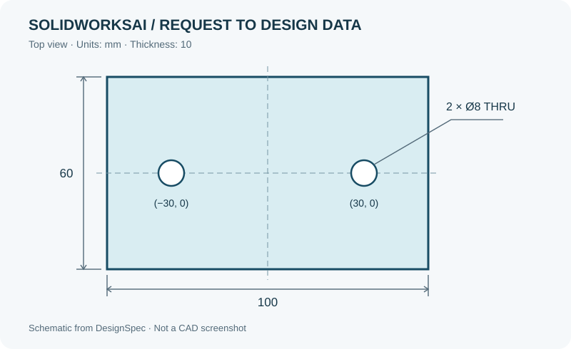
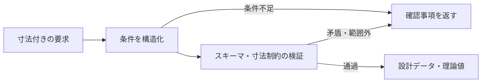

# SolidWorksAI — 要求を整理し、形状を検証する

生成AIを活用した機械設計支援を目指す個人開発です。**「寸法付きの要求を、検証できる設計データに変換する」**部分を、小さな実例で紹介します。

この公開版は、元プロジェクトの要求解析・検証コードを抜粋したポートフォリオです。Pythonだけで試せるデモと、元プロジェクトで記録したCADの検証結果を収録しています。



## まず見るところ

| 確認したいこと | ファイル |
|---|---|
| 何を入力し、何が得られるか | 下の実行例 / [実行結果](examples/plate_result.json) |
| 条件不足・矛盾をどう扱うか | [要求解析](swai_demo/parser.py) / [設計条件の検証](swai_demo/schema.py) |
| 実際の形状をどう確かめたか | [CAD実行記録](evidence/plate/README.md) |
| どんな失敗を確認しているか | [テスト](tests/test_demo.py) |

## 動かす

Python 3.12で動作確認しています。依存パッケージのインストール後は、APIキーやCADソフトなしで実行できます。

```bash
python -m pip install -r requirements.txt
python -m swai_demo --request-file examples/plate_ja.txt
python -m unittest discover -s tests -v
```

入力例：

> 幅100 mm、奥行60 mm、厚さ10 mmの板を作り、板の中央線上で左右30 mmの位置に直径8 mmの貫通穴を2個開けて

デモは設計条件をJSONに変換し、スキーマと形状に関する制約を検証します。成功時には次の**理論値**を返します。

| 項目 | 出力 |
|---|---|
| 外形寸法 | 100 × 60 × 10 mm |
| 穴の中心 | (−30, 0)、(30, 0) mm |
| 穴径・個数 | 8 mm・2個 |
| 体積 | 約58,994.690 mm³ |

**このデモの実行ではCADファイルを生成しません。** `validated` は設計データの検証通過を表し、実形状の検証とは区別しています。上の図も設計データから描いた模式図です。

寸法・穴数・貫通かどうかが不足すると、推測で埋めずに確認事項を返します。

```bash
python -m swai_demo --request-file examples/missing_dimensions_ja.txt
```

この例の終了コードは `2`、結果は `clarification_required` です。[確認事項の出力例](examples/clarification_result.json)も収録しています。

## 設計で重視したこと



- **要求をデータとして扱う。** 元プロジェクトでは、検証した設計データを固定テンプレートによるCAD生成につなげます。
- **失敗を具体化する。** 単位の混在、穴同士の接触、板からはみ出す穴、深すぎる止まり穴などを検出します。
- **生成後にも確かめる。** 元のCAD実行では、STEPを再読込し、寸法・穴位置・体積・ソリッド数を照合しています。

## 自分の取り組みとAIの利用

機械工学を学びながら、要求の整理、AIへの指示・制約の具体化、出力の確認、修正方針の検討に取り組んでいます。コードやテスト、文書の作成・修正には生成AIの支援を広く利用しています。この公開版の整理と追加テストもAI支援を受けて行っています。

公開デモの要求解析自体はルールベースです。AIの開発支援を活用しつつ、実行時の処理と確認手順を追える構成を目指しています。

## 対象と限界

公開CLIの対象は、例文形式で寸法を指定した矩形板と、左右対称の2穴（貫通穴・止まり穴）です。mmまたはinchを扱い、内部ではmmに統一します。任意の自然言語、複雑な部品、アセンブリ、FEM・最適化はこのデモの対象外です。強度や加工可能性の判断も行いません。

元プロジェクトには別の形状や実行基盤もありますが、この公開版で再現できる範囲は上記に限定しています。抜粋コードの出典・変更点は[構成と出典](docs/source_notes.md)に記載しています。
